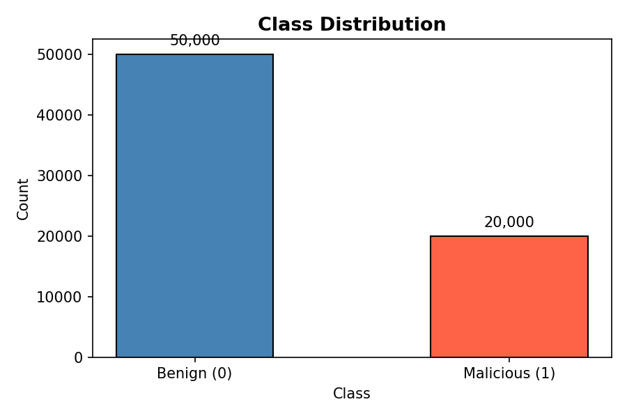
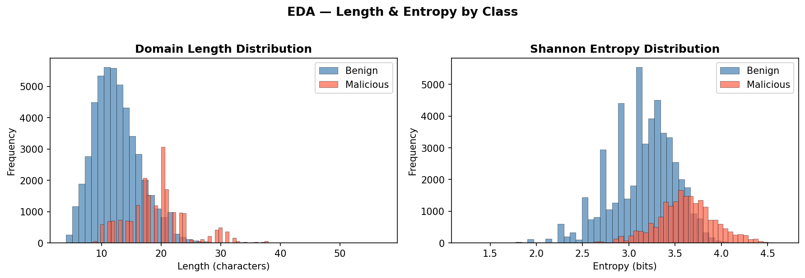
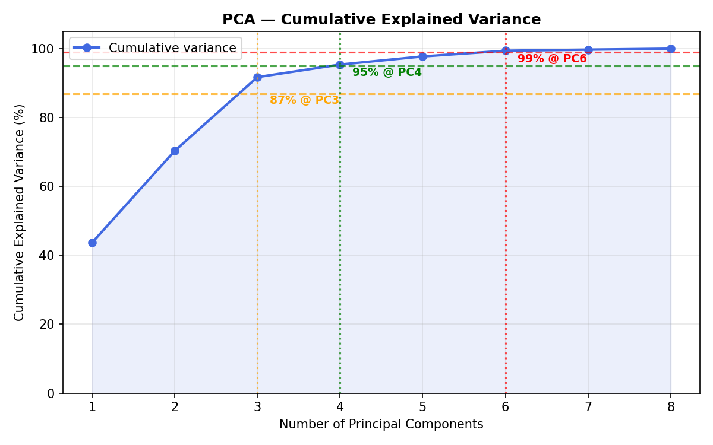
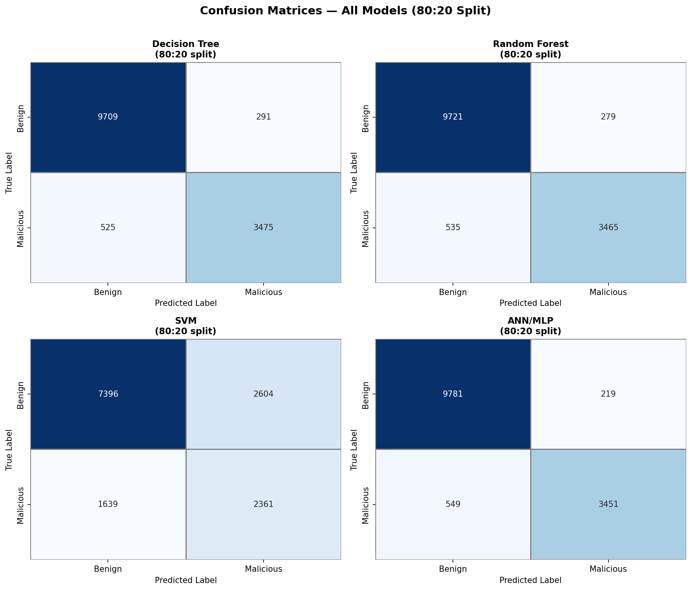
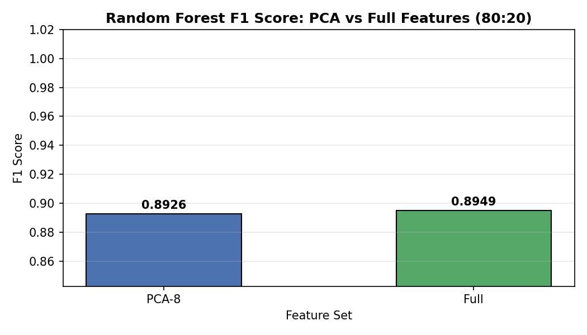
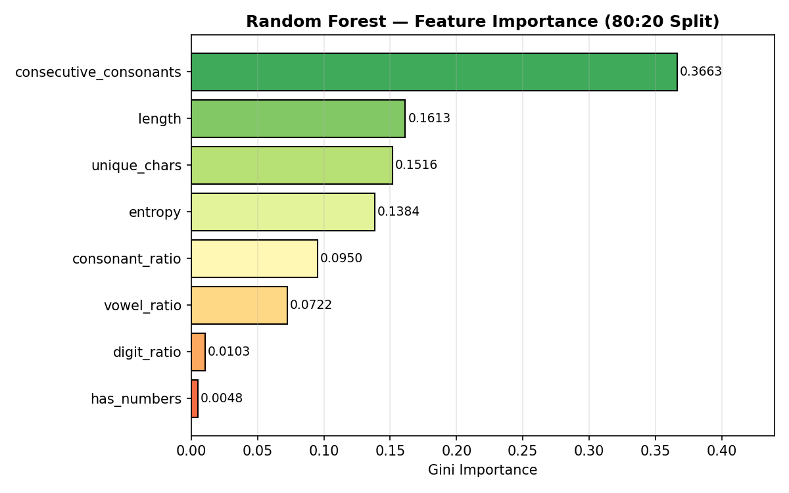
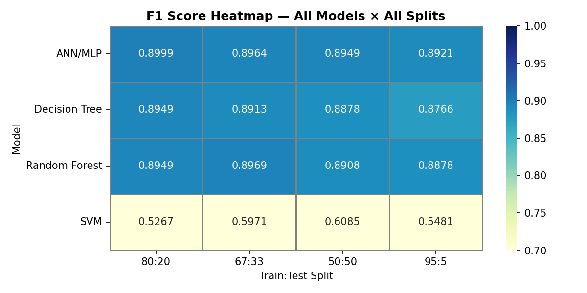

# DNS Anomaly Detection Using Machine Learning


> **Team: Analytics Shield** \
> **Team Leader: Durga Sai Sri Ramireddy** \
> **Team Members:** Surabhi Kandala, Gurunivas Mudiraj \
> University of Houston · MS Cybersecurity

---

## TL;DR

Built a complete ML pipeline that detects **DGA (Domain Generation Algorithm)** malicious domain names vs. legitimate ones purely from the domain string itself. No network traffic. No packet captures. Just the name.

**Best result: ANN/MLP with F1 = 0.8999 (90%) on an 80:20 split.**

---

## Table of Contents

- [The Problem](#the-problem)
- [Dataset](#dataset)
- [Pipeline Overview](#pipeline-overview)
- [Phase 1 - EDA](#phase-1--eda)
- [Phase 2 - Feature Extraction](#phase-2--feature-extraction)
- [Phase 3 - Preprocessing](#phase-3--preprocessing)
- [Phase 4 - PCA](#phase-4--pca)
- [Phase 5 - Model Training](#phase-5--model-training)
- [Results](#results)
- [Key Findings](#key-findings)
- [Limitations & Future Work](#limitations--future-work)
- [Getting Started](#getting-started)
- [Plots](#plots)
- [References](#references)

---

## The Problem

When malware infects a machine, it needs to phone home, meaning reach the attacker's server for instructions. To avoid blacklists, it uses **Domain Generation Algorithms (DGA)** to auto-generate hundreds of random domain names every day. The attacker registers one of them and waits.

Blacklists don't work. By the time one domain gets blocked, the malware has already moved to the next.

**Our approach:** train a model to look at the domain name itself and decide if a human picked this, or did an algorithm?

> Humans pick names they can pronounce. Algorithms don't care.

MITRE ATT&CK maps this to **[T1568 - Dynamic Resolution](https://attack.mitre.org/techniques/T1568/)** under Command & Control evasion.

---

## Dataset

| Source | Description | Label | Count |
|--------|-------------|-------|-------|
| `dga-domain.txt` | Real DGA domains from netlab360 feed (Nymaim, Mirai families) | `1` - Malicious | 20,000 |
| `top-1m.csv` | Alexa Top-1 Million legitimate websites | `0` - Benign | 50,000 |
| **Combined** | Shuffled, labeled, ready for pipeline | - | **70,000** |

Class split: **71.4% benign / 28.6% malicious** - intentionally imbalanced to reflect real network traffic.

---

## Pipeline Overview

```
Raw domain strings
       │
       ▼
┌─────────────────┐
│  Data Loading   │  20k DGA + 50k Alexa → 70k records, shuffled
└────────┬────────┘
         │
         ▼
┌─────────────────┐
│      EDA        │  Length & entropy distributions per class
└────────┬────────┘
         │
         ▼
┌─────────────────┐
│    Feature      │  Strip TLD → extract 8 lexical features
│   Extraction    │  per domain string
└────────┬────────┘
         │
         ▼
┌─────────────────┐
│  Preprocessing  │  dropna → VarianceThreshold → StandardScaler
│   (4 steps)     │  → LabelEncoder
└────────┬────────┘
         │
         ▼
┌─────────────────┐
│      PCA        │  Variance analysis, 3 feature set configs
└────────┬────────┘
         │
         ▼
┌─────────────────┐
│    Training     │  4 models × 4 split ratios = 16 combinations
└────────┬────────┘
         │
         ▼
┌─────────────────┐
│   Evaluation    │  F1, Precision, Recall, Confusion Matrices,
│                 │  Feature Importance
└─────────────────┘
```

---

## Phase 1 - EDA

Before touching any model, we visualized what separates DGA domains from legitimate ones.

**Finding 1 - Domain Length:**  
DGA domains average **15-20 characters**. Legitimate domains average **6-10**. Real names are short because humans have to remember them.

**Finding 2 - Shannon Entropy:**  
Entropy measures how random a string is. Legitimate domains follow natural language patterns. DGA domains are generated by pseudo-random algorithms, their character distributions are near-uniform, producing high entropy.

| Class | Entropy Range |
|-------|--------------|
| Benign | 2.4 - 3.0 bits |
| Malicious (DGA) | 3.2 - 3.8 bits |

**Sample domains:**
```
Benign:    mlstatic.com · copaair.com · obi.at
Malicious: midydcmulixgxf.com · qntvrdqecknjhxkkr.com · hmirveqwnuqt.jp
```

---

## Phase 2 - Feature Extraction

Each domain was converted into **8 numerical features**. ML models can't read text - these features capture the statistical properties of each string.

> TLD stripped first: `google.com` → `google`, `xkqzpwrt.ru` → `xkqzpwrt`

| Feature | Description | Importance (RF) |
|---------|-------------|----------------|
| `consecutive_consonants` | Longest back-to-back consonant run | **#1 - 0.3663** |
| `length` | Character count | #2 - 0.1613 |
| `unique_chars` | Distinct characters used | #3 - 0.1516 |
| `entropy` | Shannon randomness score | #4 - 0.1384 |
| `consonant_ratio` | Fraction of consonants | #5 - 0.0950 |
| `vowel_ratio` | Fraction of vowels | #6 - 0.0722 |
| `digit_ratio` | Fraction of digits | #7 - 0.0103 |
| `has_numbers` | Binary: contains any digit | #8 - 0.0048 |

> **Surprise finding:** `consecutive_consonants` ranked #1 at 0.3663 - not entropy as EDA suggested. No human names a website `xkqzpwrt`. An algorithm would. The longest unpronounceable consonant run turned out to be a stronger DGA signal than overall randomness alone.

Feature matrix output shape: **(70,000 × 9)**

---

## Phase 3 - Preprocessing

Four steps applied in this exact order - order matters.

```python
# Step a: Remove null rows
pre = features_df.dropna().reset_index(drop=True)
# Output: (70000, 9) - no nulls existed

# Step b: Remove zero-variance features
vt = VarianceThreshold(threshold=0.0)
X_vt = vt.fit_transform(X_raw)
# Output: (70000, 8) - all 8 features retained

# Step c: Normalize - MUST happen before PCA
scaler = StandardScaler()
X_scaled = scaler.fit_transform(X_vt)
# Output: (70000, 8) - mean=0, std=1

# Step d: Confirm integer labels
le = LabelEncoder()
y = le.fit_transform(y_raw)
# Label classes: [0, 1]
```

**Why StandardScaler before PCA:** PCA finds directions of maximum variance. Unscaled features distort those directions - `length` (range 4-20) would dominate `digit_ratio` (range 0-1) regardless of actual informativeness.

**Class imbalance handling:**
- Used `F1-score` as primary metric (accuracy is misleading on a 71/29 split)
- Used `stratify=y` in all train/test splits
- Acknowledged limitation: `class_weight='balanced'` and SMOTE were not applied - future work

---

## Phase 4 - PCA

```
Cumulative Explained Variance:
  PC1:  43.70%
  PC2:  70.36%
  PC3:  91.75%  ← 87% threshold crossed
  PC4:  95.39%  ← 95% threshold crossed
  PC6:  99.41%  ← 99% threshold crossed
  PC8: 100.00%
```

Three feature sets created and compared:

| Feature Set | Components |
|-------------|-----------|
| `X_pca_10` | 10 (capped to 8) |
| `X_pca_25` | 25 (capped to 8) |
| `X_full` | All 8 features, no PCA |

Since we only have 8 features, all three sets were identical. PCA showed no compression benefit at this scale but demonstrates the technique and becomes essential when extending to n-gram frequency features.

---

## Phase 5 - Model Training

**4 models × 4 split ratios = 16 combinations.**

```python
models = {
    'Decision Tree': DecisionTreeClassifier(max_depth=10, random_state=42),
    'Random Forest': RandomForestClassifier(n_estimators=100, max_depth=10, random_state=42),
    'SVM':           SVC(kernel='rbf', C=1.0, max_iter=100, random_state=42),
    'ANN/MLP':       MLPClassifier(hidden_layer_sizes=(64, 32), max_iter=300, random_state=42)
}

splits = [(0.20, '80:20'), (0.33, '67:33'), (0.50, '50:50'), (0.05, '95:5')]
```

---

## Results

### 80:20 Split - All Models

| Model | Accuracy | Precision | Recall | F1 | Train Time |
|-------|---------|-----------|--------|-----|------------|
| **ANN/MLP** | **94.51%** | **94.03%** | **86.28%** | **0.8999** | 87.9s |
| Random Forest | 94.19% | 92.55% | 86.62% | 0.8949 | 1.15s |
| Decision Tree | 94.17% | 92.27% | 86.88% | 0.8949 | 0.21s |
| SVM | 69.69% | 47.55% | 59.03% | 0.5267 | 1.93s |

> SVM underperformed due to `max_iter=100` - insufficient for convergence on 56,000 training samples.

---

### Confusion Matrices - 80:20 Split

| Model | TN | FP | FN | TP |
|-------|----|----|----|----|
| Decision Tree | 9,709 | 291 | 525 | 3,475 |
| Random Forest | 9,721 | 279 | 535 | 3,465 |
| SVM | 7,396 | 2,604 | 1,639 | 2,361 |
| **ANN/MLP** | **9,781** | **219** | 549 | 3,451 |

ANN had the **fewest false positives (219)**. SVM missed 1,639 real attacks - the worst false negative rate in the comparison.

---

### F1 Score Across All Splits

| Model | 80:20 | 67:33 | 50:50 | 95:5 |
|-------|-------|-------|-------|------|
| **ANN/MLP** | **0.8999** | 0.8964 | 0.8949 | 0.8913 |
| Random Forest | 0.8949 | **0.8969** | 0.8908 | 0.8878 |
| Decision Tree | 0.8949 | 0.8913 | 0.8878 | 0.8766 |
| SVM | 0.5267 | 0.5971 | 0.6085 | 0.5481 |

---

### PCA Comparison - Random Forest, 80:20 Split

| Feature Set | F1 |
|-------------|-----|
| PCA-8 | 0.8926 |
| Full features | 0.8949 |

Minimal difference - feature set was already compact.

---

## Key Findings

**1. ANN was best by metric - Random Forest was best for production.**  
ANN scored F1=0.8999 but took 87.9 seconds. Random Forest scored F1=0.8949 in 1.15 seconds - **76× faster** for a 0.005 difference in F1. For real-time DNS monitoring, Random Forest wins.

**2. Consecutive consonants beat entropy.**  
EDA pointed to entropy as the dominant signal. The Random Forest disagreed - `consecutive_consonants` scored 0.3663 vs entropy's 0.1384. Unpronounceable strings like `xkqzpwrt` are a stronger per-string discriminator than global character randomness.

**3. 80:20 split consistently outperformed.**  
More training data helps. The 95:5 split (3,500 test samples) is too small for reliable evaluation.

**4. Class imbalance was handled at evaluation level only.**  
`class_weight='balanced'` and SMOTE were not applied - acknowledged limitation.

---

## Limitations & Future Work

- `class_weight='balanced'` and SMOTE not applied - minority class underrepresented during training
- SVM performance artificially limited by `max_iter=100` cap
- n-gram character frequency features would significantly enrich the feature space
- Isolation Forest layer for zero-day DGA families not seen in training data
- Real-time DNS monitoring integration not implemented

---

## Getting Started

### Requirements

```bash
conda create -n dns_project python=3.10
conda activate dns_project
pip install pandas numpy scikit-learn matplotlib seaborn jupyter
```

### Datasets

1. **DGA domains** - search `DGA domain detection` on [Kaggle](https://www.kaggle.com)
2. **Alexa top-1M** - search `top-1m alexa` on [Kaggle](https://www.kaggle.com)


### Run

```bash
jupyter notebook
# Open dns_anomaly_detection.ipynb
# Kernel → Restart & Run All
```

---

## Plots


\






---

## Skills Demonstrated

- Domain-specific feature engineering from raw text strings
- Complete supervised ML pipeline (EDA → preprocessing → PCA → training → evaluation)
- Multi-model comparison across multiple experimental conditions
- Class imbalance analysis and metric selection (F1 over accuracy)
- MITRE ATT&CK context - DGA maps to C2 evasion (T1568)
- Visualization of ML results for non-technical audiences
- Identification of model limitations and future work

---

## Presentation

📺 Full project walkthrough on YouTube: [YouTube](https://youtu.be/BRD8PHBkOSc?si=SlA6gg0d43GXvjVe)

---

## References

- [MITRE ATT&CK - T1568 Dynamic Resolution](https://attack.mitre.org/techniques/T1568/)
- [Scikit-learn Documentation](https://scikit-learn.org/stable/)
- [Shannon Entropy - Information Theory](https://en.wikipedia.org/wiki/Entropy_(information_theory))
- [Alexa Top Sites](https://www.alexa.com/topsites)

---

**Author:** Durga Sai Sri Ramireddy | MS Cybersecurity, University of Houston  
[](https://linkedin.com/in/durga-ramireddy)
[](https://github.com/DurgaRamireddy)
